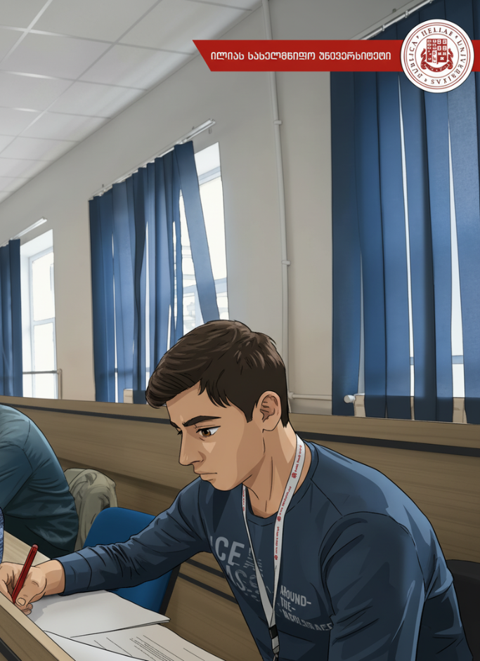

# vazha lomidze

---

## Contact Information

- Email: vazhalomidze1998@gmail.com  
- Phone: +995 599 25 92 25 
- Discord: vazha(@vazhalomidze1998) 
- GitHub: [github.com/vazhalomidze](https://github.com/vazhalomidze1998)  
- LinkedIn: [linkedin.com/in/vazhalomidze](https://www.linkedin.com/in/vazha-lomidze-225492195/)  

---

## About Me

I am a passionate frontend developer with a strong desire to create user-friendly and accessible web applications. Currently focused on improving my skills with Angular, react and TypeScript, I enjoy solving complex problems and learning new technologies.

---

## Skills

- **Languages:** JavaScript, TypeScript, HTML5, CSS3  
- **Frameworks/Libraries:** Angular, React  
- **Tools:** Git, Webpack, VS Code  
- **Methodologies:** Agile, Scrum  
- **Version Control:** Git, GitHub, Bitbucket  

---

## Code Example

function calculateAge(birthYear) {
  const dirthDate = new Date(birthYear);
  const now = new Date();

  let years = now.getFullYear() - dirthDate.getFullYear();
  let months = now.getMonth() - dirthDate.getMonth();
  let days = now.getDate() - dirthDate.getDate();

  if (days < 0) {
    months -= 1;
    const prevMonth = new Date(now.getFullYear(), now.getMonth(), 0).getDate();
    days += prevMonth;
  }

  if (months < 0) {
    years -= 1;
    months += 12;
  }

  if (years >= 1) {
    return `You are ${years} years old`;
  } else if (months >= 1) {
    return `You are ${months} months`;
  } else {
    return `You are ${days} days`;
  }
}

## Work Experience

I have 4 years of experience working with Angular 0, when i started a job i were a junior react developer 1 year

### Frontend Developer Intern  
   June 2020 to August 2025
- Developed responsive user interfaces with Angular0  Z
- Assisted in form validation and API integration  
- Collaborated in Agile team sprints  

## Education

Bachelor student of Science in Computer Science  

Completed online courses:  
- "Become a Full-Stack Web Developer with just ONE course. HTML, CSS, Javascript, Node, React,    PostgreSQL, Web3 and DApps" on Udemy  
- “The modern JavaScript course for everyone! Master JavaScript with projects, challenges and theory. Many courses in one!” udemy
“The modern JavaScript course for everyone! Master JavaScript with projects, challenges and theory. Many courses in one!” udemy

---

## English Language

- Intermediate (B2)

## Georgian Language

- Native
